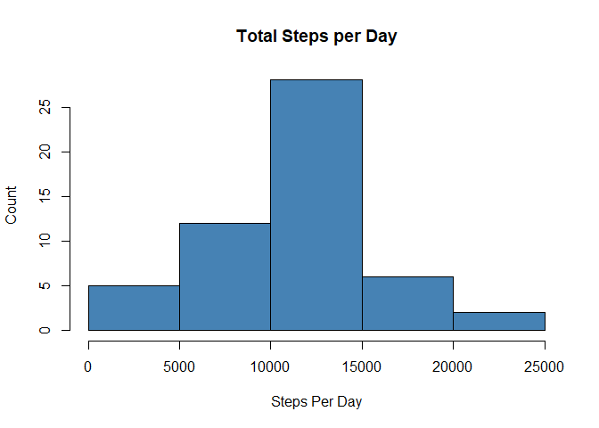
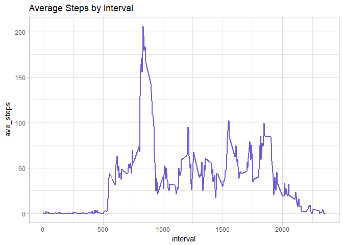
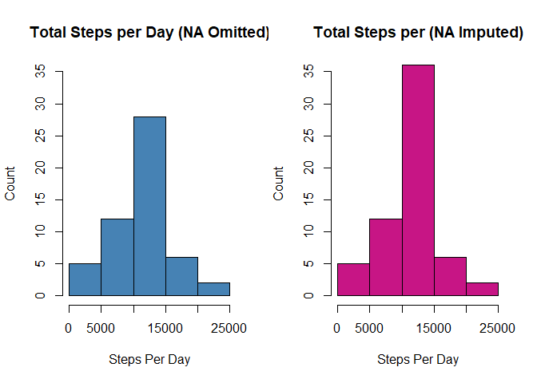
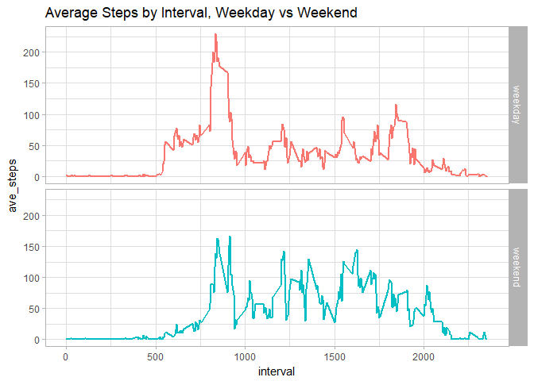

## Loading and preprocessing the data

Show any code that is needed to

  1.  Load the data (i.e. read.csv())

```r
##set your working directory to the same location you downloaded and unzipped the data
activity <- read.csv("activity.csv", stringsAsFactors=FALSE)
```
  
  2.  Process/transform the data (if necessary) into a format suitable for your analysis
  
 

```r
## Load dplyr and lubridate packages
library(dplyr)
library(lubridate)

##Convert date field to date format
activity$date <- ymd(activity$date)

##Remove NA's from data
activity_na.rm <- na.omit(activity)
```

## What is mean total number of steps taken per day?

  1.Calculate the total number of steps taken per day

```r
##Calculate total number of steps taken per day
steps_per_day <- summarize(group_by(activity_na.rm, date), total_steps=sum(steps))
```
  
  2.Make a histogram of the total number of steps taken each day

```r
hist(steps_per_day$total_steps,xlab="Steps Per Day", ylab="Count", main="Total Steps per Day", col="steelblue")
```

<!-- -->
  
  3.Calculate and report the mean and median of the total number of steps taken per day

```r
paste ("Mean:",round(mean(steps_per_day$total_steps)),"steps", sep = " ", collapse = NULL)
```

```
## [1] "Mean: 10766 steps"
```

```r
paste ("Median:",round(median(steps_per_day$total_steps)),"steps", sep = " ", collapse = NULL)
```

```
## [1] "Median: 10765 steps"
```


## What is the average daily activity pattern?

  1.  Make a time series plot (i.e. type = "l") of the 5-minute interval (x-axis) and the average number of steps taken, averaged across all days (y-axis)


```r
library(ggplot2)

##Calculate the average number of steps taken by interval
ave_per_int <- summarize(group_by(activity_na.rm, interval), ave_steps= mean(steps))

##Create time series
g <- ggplot(ave_per_int, aes(interval, ave_steps))
g + geom_line(color="slateblue3", size = 1, show.legend = F) + labs(title = "Average Steps by Interval") + theme_light()
```

<!-- -->
  
  2.  Which 5-minute interval, on average across all the days in the dataset, contains the maximum number of steps?
  

```r
filter(ave_per_int, ave_steps==max(ave_steps))$interval
```

```
## [1] 835
```

## Imputing missing values

  1.  Calculate and report the total number of missing values in the dataset (i.e. the total number of rows with NAs)
  

```r
sum(is.na(activity$step))
```

```
## [1] 2304
```
  
  
  2.  Devise a strategy for filling in all of the missing values in the dataset. The strategy does not need to be sophisticated. For example, you could use the mean/median for that day, or the mean for that 5-minute interval, etc.
  3.  Create a new dataset that is equal to the original dataset but with the missing data filled in.
  

```r
##Substitute mean for that 5-minute interval for NAs
activity <- merge(x=activity, y=ave_per_int, by = "interval", all.x=TRUE)
activity_impute <- mutate(activity, steps = ifelse(is.na(steps),ave_steps,steps))
```
  

  4.  Make a histogram of the total number of steps taken each day and Calculate and report the mean and median total number of steps taken per day. Do these values differ from the estimates from the first part of the assignment? What is the impact of imputing missing data on the estimates of the total daily number of steps?
  

```r
##Calculate total number of steps by day for imputed data
steps_per_day_imp <- summarize(group_by(activity_impute, date), total_steps=sum(steps, na.rm=TRUE))

##Graph total steps before and after imputing, side by side, on same scale
par(mfrow=c(1,2))
hist(steps_per_day$total_steps,xlab="Steps Per Day", ylab="Count", main="Total Steps per Day (NA Omitted)", col="steelblue",ylim=c(0,35))
hist(steps_per_day_imp$total_steps, xlab="Steps Per Day", ylab="Count", main="Total Steps per (NA Imputed)", col = "mediumvioletred", ylim=c(0,35))
```

<!-- -->

## Are there differences in activity patterns between weekdays and weekends?

  1.  Create a new factor variable in the dataset with two levels - "weekday" and "weekend" indicating whether a given date is a weekday or weekend day.
  

```r
activity_impute$day <- ifelse(
    wday(activity_impute$date)==7 | wday(activity_impute$date)==1,"weekend", "weekday")
```
  
  2.  Make a panel plot containing a time series plot (i.e. type = "l") of the 5-minute interval (x-axis) and the average number of steps taken, averaged across all weekday days or weekend days (y-axis). 
  

```r
##Calculate average steps by 5-minute interval and weekday vs weekend
ave_per_int.day <- summarize(group_by(activity_impute,interval,day),ave_steps = mean(steps))

##Graph average steps by interval, Weekday vs Weekend, time series
q <- ggplot(ave_per_int.day,aes(interval, ave_steps))
q + facet_grid(day~.) +  geom_line(aes(color=day), size = 1, show.legend = F) + labs(title = "Average Steps by Interval, Weekday vs Weekend", xlab= "Number of Steps") + theme_light()
```

<!-- -->
